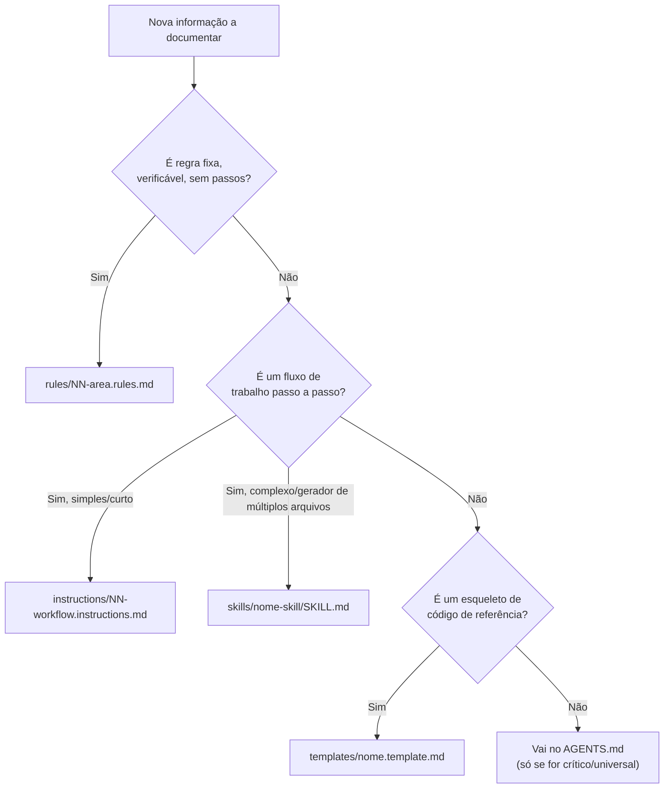

# Índice Mestre do Harness Development — SVVDST

Bem-vindo ao índice mestre da documentação de **Harness Development** do **SVVDST** (Sistema de Gestão de Produção & Bordados Computadorizados).
Esta documentação é versionada junto ao código e fornece ao desenvolvedor e aos agentes de IA **contexto determinístico, restrições e padrões acionáveis** para evolução consistente do sistema.

---

## 1. Papel do Projeto
O **SVVDST** é uma plataforma operacional e técnica para confecções têxteis e ateliês de bordado computadorizado. O sistema centraliza:
- **Gestão de Lotes de Produção & Pedidos:** Montagem de pedidos multipeças (jalecos, camisas, bonés), associação de bordados com locais anatômicos permitidos e apuração de custos em tempo real.
- **Catálogo Técnico Geral:** Acervo de matrizes e brasões com extração técnica de pontos, paradas de cor, marcas de linha e suporte visual multimídia (Arte Digital vs. Foto Real).
- **Motor de Bordado Tajima (`.dst`):** Geração e conversão paramétrica de matrizes de nomes e especialidades médicas/profissionais com `pyembroidery` e `freetype-py`.
- **Arquitetura Resiliente:** Operação híbrida com suporte a SQLite local e PostgreSQL na nuvem (Supabase/Neon), além de interface reativa via Streamlit.

---

## 2. Estrutura de Código-Fonte Relevante

```text
svvdst/
├── core/                                   # Camada de Domínio e Persistência
│   ├── database.py                         # Engine híbrido resiliente (PostgreSQL Supabase / SQLite local)
│   ├── models.py                           # Modelos SQLModel (Templates de Catálogo e Entidades de Produção)
│   └── repository.py                       # Padrão Repository: Operações de persistência com eager loading
├── pages/                                  # Camada de Apresentação (Interface Streamlit)
│   ├── home.py                             # Visão geral e dashboard inicial
│   ├── gerar_lote.py                       # Configurador de pedidos/lotes (Layout 16:9 de tela única)
│   ├── pecas.py                            # Catálogo de Bordados e Gestão de Peças
│   ├── login.py                            # Tela de autenticação centralizada (OAuth Google/Meta e Senha)
│   ├── visualizar_lotes.py                 # Painel de acompanhamento e alteração de status de lotes
│   ├── gerar_bordado.py                    # Geração técnica individual de matriz DST com preview
│   └── gerar_bordado_em_lote.py            # Geração em lote de matrizes nominais
├── utils/                                  # Utilitários e Serviços Especializados
│   ├── auth.py                             # Verificação de login e barreira de segurança por página
│   ├── ecosystem_data.py                   # Loader compartilhado de fontes e matrizes prontas
│   ├── embroidery_reader.py                # Leitor técnico de arquivos DST/PES (pontos, cores, dimensões)
│   └── storage.py                          # Upload e sincronização de imagens no Supabase Storage CDN
├── fontsfiles/                             # Fontes TTF e alfabetos bordados pré-digitalizados
├── matrizes/                               # Acervo de arquivos de bordado (.dst, .pes, .exp)
├── uploads/                                # Armazenamento persistente de artes digitais e fotos reais
├── app.py                                  # Entrypoint principal, roteamento e autenticação global
├── pages_sections.toml                     # Mapeamento oficial de menu, páginas e ícones
├── name_maker.py                           # Motor de posicionamento e composição de matrizes DST
├── indexar_acervo.py                       # CLI para varredura e catalogação automática de matrizes
├── AGENTS.md                               # Pilar 0: Instruções globais carregadas a cada sessão
└── .agents/                                # Camada estruturada do Harness (Pilares 1 a 4)
    ├── rules/                              # Pilar 1: Regras arquiteturais e restrições inegociáveis
    ├── instructions/                       # Pilar 2: Roteiros passo a passo de tarefas recorrentes
    ├── skills/                             # Pilar 3: Habilidades complexas e automações
    └── templates/                          # Pilar 4: Modelos e esqueletos de código
```

---

## 3. Os 4 Pilares do Harness

- **Pilar 1 — `rules/` (Regras Pontuais):** Diretrizes afirmativas e verificáveis (sim/não) para decisões arquiteturais, integridade de banco de dados e restrições do sistema.
- **Pilar 2 — `instructions/` (Workflows / Roteiros):** Roteiros numerados e sequenciais de "como fazer" tarefas recorrentes de ponta a ponta com caminhos de arquivo.
- **Pilar 3 — `skills/` (Habilidades / Automações):** Pacotes autocontidos (`SKILL.md`) que orquestram tarefas complexas e geração de múltiplos arquivos coordenados.
- **Pilar 4 — `templates/` (Modelos de Código):** Esqueletos de código completos e copiáveis com placeholders padronizados para Streamlit, SQLModel e Repositórios.

---

## 4. Catálogo Completo de Documentos

### Pilar 1 — Regras (`rules/`)
- [00-harness-lifecycle.rules.md](rules/00-harness-lifecycle.rules.md): **(Regra Primária)** Atualização e sincronização contínua do próprio harness a cada mudança ou nova decisão.
- [01-architecture-layers.rules.md](rules/01-architecture-layers.rules.md): Separação estrita em camadas (pages -> repository -> models/db), proibição de SQL raw em páginas e uso de sessões com context manager.
- [02-database-hybrid.rules.md](rules/02-database-hybrid.rules.md): Diretrizes para compatibilidade dual SQLite local / PostgreSQL Supabase sem dependências de dialetos exclusivos.
- [03-code-style-ui.rules.md](rules/03-code-style-ui.rules.md): Padrões de interface Streamlit, chaves únicas de widgets, layout 16:9 compacto e barreira de autenticação obrigatória.
- [04-embroidery-domain.rules.md](rules/04-embroidery-domain.rules.md): Regras de manipulação de matrizes de bordado (.dst), escalas em milímetros, comandos de parada e caminhos relativos com barra normal (`/`).
- [05-junior-mentor-didactics.rules.md](rules/05-junior-mentor-didactics.rules.md): Postura didática de mentoria para desenvolvedor júnior e regra obrigatória de "Alerta de Novidade" ao sugerir novas libs ou padrões.
- [06-authentication-rbac.rules.md](rules/06-authentication-rbac.rules.md): Autenticação centralizada com Supabase Auth (Google, Meta, Senha Mestra) e controle de acesso RBAC (admin, operador, cliente) com visibilidade granular de páginas e matrizes.
- [07-network-proxy-cloudflare.rules.md](rules/07-network-proxy-cloudflare.rules.md): Infraestrutura de rede para proxies reversos, Cloudflare (Flexible SSL, compressão WebSocket desativada) e roteamento de callbacks OAuth com `APP_URL`.


### Pilar 2 — Instruções (`instructions/`)
- [01-add-streamlit-page.instructions.md](instructions/01-add-streamlit-page.instructions.md): Roteiro sequencial para criar uma nova subpágina no Streamlit com autenticação, layout e inclusão no `pages_sections.toml`.
- [02-add-repository-method.instructions.md](instructions/02-add-repository-method.instructions.md): Passo a passo para criar novos métodos de consulta e mutação em `core/repository.py` com eager loading.
- [03-extend-model-field.instructions.md](instructions/03-extend-model-field.instructions.md): Roteiro para adicionar novos campos a entidades existentes (ex: `TemplateBordado`, `Peca`, `Lote`) mantendo compatibilidade do banco.
- [04-index-embroidery-acervo.instructions.md](instructions/04-index-embroidery-acervo.instructions.md): Procedimento para executar o script de indexação em lote e catalogar novas matrizes no banco.

### Pilar 3 — Habilidades (`skills/`)
- [scaffold-page/SKILL.md](skills/scaffold-page/SKILL.md): Gerador automatizado de ponta a ponta para novas páginas completas (Página Streamlit + Métodos de Repositório + Roteamento).
- [embroidery-extractor/SKILL.md](skills/embroidery-extractor/SKILL.md): Extração técnica de propriedades de bordado (pontos, dimensões, trocas de cor, cores acompanhantes).

### Pilar 4 — Templates (`templates/`)
- [streamlit-page.template.md](templates/streamlit-page.template.md): Esqueleto de nova tela Streamlit com autenticação, tratamento de estado e layout padronizado.
- [repository-method.template.md](templates/repository-method.template.md): Esqueleto de métodos no `CatalogoRepository` ou `LoteRepository` com gerenciamento de sessão e relacionamentos carregados.
- [sqlmodel-entity.template.md](templates/sqlmodel-entity.template.md): Esqueleto de entidade SQLModel com `extend_existing`, campos tipados e relacionamentos bidirecionais.

---

## 5. Fluxo de Decisão: Onde Documentar Algo Novo


